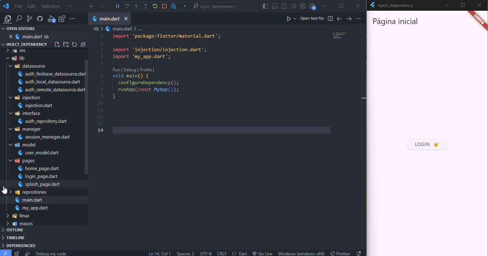

<h1 align="center">Injeção de Dependência com Get It</h1>

<p align="align-left">O proje é bem simples com apenas três três telas(Splash, login, home) apenas para demonstração com foco no uso do GetIt, para tal foi feito uma estrutura de pastas afim de se o mais próximo das melhores práticas de padrões de projetos.</p>

<p align="center">



</p>

## O que encontramos no projeto

* Uso do Get It
* Registro de LazySigton
* Registro de Factory
* Criação da Arquitetura Demo
* Aplicando a Injeção de Dependências
* Princípio da Inversão de Dependência

## Passos para clonar e executar o projeto

1. **Clone o repositório**

 Abra o terminal e execute o seguinte comando para clonar o repositório:

 ```bash
# Clone este repositório
$ git clone <git@github.com:luizzlcs/inject_dependency.git>


$ Após acessar o dirtório digite no prompt de comando dart main.dart
````
2. **Navegue até o diretório do projeto**

```bash
# Acesse  a pasta do projeto no terminal/cmd
$ cd inject_dependency
````
3. **Instale as dependências**

```bash
$ dart pub get
````
4. **Execute o projeto**

    Para executar o projeto, use o seguinte comando:

```bash
$ dart run
````
## Licença

Este projeto está licenciado sob a Licença XYZ.

### 🎲 Rodando o Projeto


---
### Autor
Começou a estudar Dart e Flutter em 2021, desde 2022 atua na Ponto Care Franchise aplicando os seus conhecimentos em uma aplicação para Android e Web.


[](https://www.linkedin.com/in/luizzlcs/)
